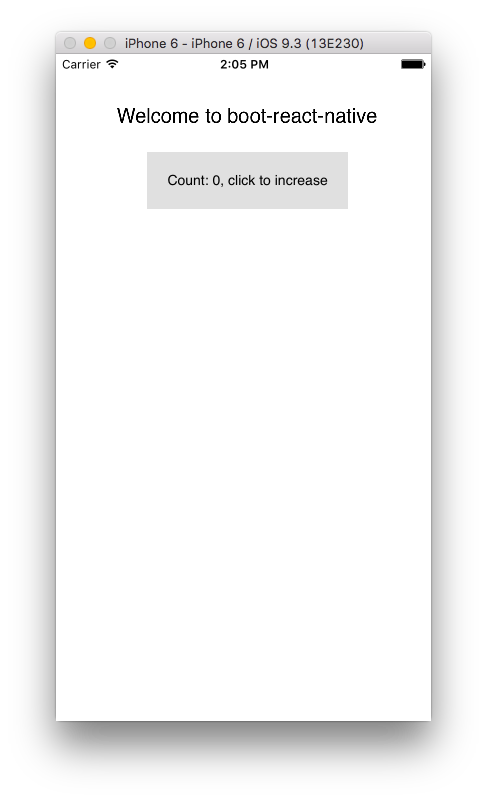

# Boot React Native, Part 1: up and running

Mobile applications are ClojureScript's next frontier. As a compile-to-javascript
language, ClojureScript can run on mobile devices, targetting Facebook's
wonderful React Native framework. The combination is powerful: [React Native](https://facebook.github.io/react-native/) is
comprehensive and performant, and ClojureScript adds better means of abstraction and
great suport for interactive development.

This last point cannot be stressed enough. Sophisticated UIs, as required in
mobile applications, are best built interactively, with a short feedback cycle.
As a LISP, ClojureScript is in a great position to make programmers more creative and
productive for app development.

So can we build React Native apps with ClojureScript today? The good news
is that most of the parts of the [CLJSRN](http://cljsrn.org/) puzzle exist and work well. The bad news:
building apps for iOS and Android with an interactive reloading bridge brings with it
significant tooling challenges.

Boot React Native is a tool that intends to make building React Native
applications with ClojureScript as seemless as possible. In this post, I will
explain how to get a basic CLJSRN setup running.

# First steps

As CLJSRN is built on React Native, the first step is to set up the React Native
development environment. The process is explained in detail in the [RN
documentation](https://facebook.github.io/react-native/docs/getting-started.html).

Make sure to install the react-native CLI tool globally using npm as explained
in the guide, as we will make extensive use of it below.

In addition to the npm dependencies, you will also need a development setup
specific to the platform you want to target.

For iOS:

* XCode, through the App Store (yes, this will only work on OS X, and yes, you'll need to install the
  whole package, IDE and all).

For Android:

* Android dev set up
* Genymotion device emulator (free for personal use)

Again refer to the [Getting Started page](https://facebook.github.io/react-native/docs/getting-started.html) for the details of your platform.

Next, to work with Boot React Native you will need to
install [Java](http://www.oracle.com/technetwork/java/javase/downloads/index.html)
and [Boot](https://github.com/boot-clj/boot). Having installed the base
dependencies, get the latest version of Boot React Native:

```
git clone https://github.com/mjmeintjes/boot-react-native.git
cd boot-react-native
boot inst
```

This installs the project's latest `master` version into your local maven repository. Make sure you're using the **latest snapshot of Boot React Native** (as of this writing, `0.3-SNAPSHOT`).

Boot React Native also comes with an example application called, logically
enough, *SimpleExampleApp*. *SimpleExampleApp* currently is the best starting
point for starting a project, as it exemplifies the best practices and a
working project structure. The app has the following basic structure:

```
example
├── app
│   ├── android
│   │   └── ... android-specific files
│   ├── build
│   │   └── ... build output
│   ├── index.android.js
│   ├── index.ios.js
│   ├── init.js
│   ├── ios
│   │   └── ... iOS-specific files
│   ├── node_modules
│   │   └── ... react native dependencies
│   └── package.json
├── build.boot
├── node_modules
├── resources
│   ├── dist.cljs.edn
│   ├── externs.js
│   ├── react.ext.js
│   └── react.native.ext.js
├── rn-goog-require.patch
└── src
    └── mattsum
        └── simple_example/core.cljs
```

The `example/` directory includes all files relating to the ClojureScript
project. The subdirectory `app/` contains the React Native portion of the
infrastructure required. Again, the `ios/` and `android/` subfolders contain the
ObjectiveC and Java code that forms the "native" shell around the React Native
application. Hopefully you'll only need to interact with these native parts in
rare situations, so you can focus your attention on the ClojureScript-based
application code.

Next, let's set up *SimpleExampleApp*.

```
$ cd example/app
$ npm install
```

This installs `react-native 0.30.0` and all its dependencies. Unfortunately,
currently Boot React Native requires a small patch to enable its live-reloading
functionality. To apply this patch to *SimpleExampleApp*, type:

```
$ cd example
$ patch -d app/node_modules/react-native -p1 < rn-goog-require.patch
patching file packager/react-packager/src/JSTransformer/worker/extract-dependencies.js
```

You'll need to repeat this step every time you re-install the react-native npm
module. This manual step is a bit annoying, but will hopefully be replaced by a
more automatic solution in the future.

# Starting the app

To start the app, you'll generally need to perform two steps:

- start the ClojureScript compiler dev environment
- start the app in the simulator along with the RN packager

Starting the ClojureScript environment is easy:

```
$ cd example
$ boot dev
Starting reload server on ws://localhost:8079
Writing boot_reload.cljs...
Writing boot_cljs_repl.cljs...
cljs: unknown option(s): :main

Starting file watcher (CTRL-C to quit)...

Adding :require adzerk.boot-reload to dist.cljs.edn...
Writing cljs-template to shim_browser_repl_bootstrap.cljs...
Found edn files -  (#boot.tmpdir.TmpFile{:dir #object[java.io.File 0x37ea8fb0 /Users/pe/.boot/cache/tmp/Users/pe/fy/boot-react-native/example/10ie/f0sqpx], :bdir #object[java.io.File 0x30a4aebf /Users/pe/.boot/cache/tmp/Users/pe/fy/boot-react-native/example/10ie/-7kd6cy], :path dist.cljs.edn, :id cf1af63da345e0a558455fc6de495f46.1469880821000, :hash cf1af63da345e0a558455fc6de495f46, :time 1469880821000})
Adding :require mattsum.boot-react-native.shim-browser-repl-bootstrap to dist.cljs.edn...
Writing cljs-template to shim_boot_reload.cljs...
Found edn files -  (#boot.tmpdir.TmpFile{:dir #object[java.io.File 0x37ea8fb0 /Users/pe/.boot/cache/tmp/Users/pe/fy/boot-react-native/example/10ie/f0sqpx], :bdir #object[java.io.File 0x30a4aebf /Users/pe/.boot/cache/tmp/Users/pe/fy/boot-react-native/example/10ie/-7kd6cy], :path dist.cljs.edn, :id 9085f304b56696c493776ef586672b32.1469880821000, :hash 9085f304b56696c493776ef586672b32, :time 1469880821000})
Adding :require mattsum.boot-react-native.shim-boot-reload to dist.cljs.edn...
Writing cljs-template to shim_repl_print.cljs...
Found edn files -  (#boot.tmpdir.TmpFile{:dir #object[java.io.File 0x37ea8fb0 /Users/pe/.boot/cache/tmp/Users/pe/fy/boot-react-native/example/10ie/f0sqpx], :bdir #object[java.io.File 0x30a4aebf /Users/pe/.boot/cache/tmp/Users/pe/fy/boot-react-native/example/10ie/-7kd6cy], :path dist.cljs.edn, :id fefe467f1dd7d7123e7008c6446d3b3f.1469880821000, :hash fefe467f1dd7d7123e7008c6446d3b3f, :time 1469880821000})
Adding :require mattsum.boot-react-native.shim-repl-print to dist.cljs.edn...
nREPL server started on port 61171 on host 127.0.0.1 - nrepl://127.0.0.1:61171
Adding :require adzerk.boot-cljs-repl to dist.cljs.edn...
Writing main.cljs.edn...
Compiling ClojureScript...
• main.js
Reading resource -  mattsum/boot_rn/js/goog_base.js
Modifying  main.out/goog/base.js  using  #function[mattsum.impl.boot-helpers/append-to-file/fn--1793]
Reading resource -  mattsum/boot_rn/js/goog_base_prepend.js
Modifying  main.out/goog/base.js  using  #function[mattsum.impl.boot-helpers/prepend-to-file/fn--1797]
Reading resource -  mattsum/boot_rn/js/reloading.js
Modifying  main.out/goog/net/jsloader.js  using  #function[mattsum.impl.boot-helpers/append-to-file/fn--1793]
Compiling {cljs-deps}... 4 changed files
Adding /Users/pe/.boot/cache/tmp/Users/pe/fy/boot-react-native/example/10ie/-iiq3az to fileset
Writing target dir(s)...
2016-07-30 14:14:26.914 java[47318:680482] 14:14:26.914 WARNING:  140: This application, or a library it uses, is using the deprecated Carbon Component Manager for hosting Audio Units. Support for this will be removed in a future release. Also, this makes the host incompatible with version 3 audio units. Please transition to the API's in AudioComponent.h.
Elapsed time: 46.486 sec
```

Once you see the `Writing target dir` message (and hear a reassuring *bing* sound), the
ClojureScript code has been compiled to a JavaScript format that the
React Native packager will understand.

# Running SimpleExampleApp

Once the Boot task is running, all we need to to is to start the native app in a
simulator. A React Native app contains a small wrapper of custom native code that
ininitializes the JavaScript environment and integrates it in the operating system.

In earlier versions, building and running an app on iOS involved opening *XCode*
and clicking the "Run" button. Fortunately, the good people of the React Native
team have automated this step so that everything can be triggered from the
command line. Starting with Boot React Native 0.3, you can simply run:

```
cd example/app; react-native run-ios
```

This builds the ObjectiveC code into a native app bundle, opens a simulator,
installs it in the simulator and launches the bundle in the simulator. If all
goes well, you should see SimpleExampleApp in the simulator window. If not, please see the Troubleshooting section below.



As the app starts, you'll notice another terminal window popping up. This is
the React Native packager, a tool that works similarly to the more well-known
browserify or webpack module bundling tools. Used with Boot React Native, the packager reads
all the cljs-generated javascript files, scans them recursively for dependencies
and produces a single bundled javascript file, not unlike what happens in single-page web applications.
The packager also acts as a webserver and serves the bundle under the url `http://localhost:8081/index.ios.bundle?platform=ios&dev=true&hot=false`.


At startup, or when reloading, the native app retrieves and executes the bundle.
As generating the bundle is computationally expensive, the packager can be a bit
slow. With ClojureScript builds, the initial bundling step can take up to 70
seconds. Unfortunately, this can be longer than the app's timeout, so if the app
reports that the bundle could not be retrieved, reload the app to give the
packager a bit more time. The good news is that the packager caches files it has
already compiled, so that subsequent reloads should be much faster, usually
completing in less than 10 s.

Hopefully you should see the app now and can interact with it by clicking on the
button. More excitingly, you can change
`example/src/mattsum/simple_example/core.cljs`
(try altering the "welcome" string). After saving, the ClojureScript compiler
will kick in. This will cause a reload event in the app to be triggered and the
string to be updated in real time. As you can see, the app's state is kept
intact during reloads, while the app's behavior is updated - a powerful feature for interactive development.

That's it for iOS. Thanks to the hard work of the React Native team, the process is similar for Android:

* Start the Genymotion emulator
* `cd example/app; rnative run-android`

You can even have both Android and iOS versions of your RN app running side by
side, with updates to your code injected in parallel to both systems in less
than 10 seconds. How's that for a short feedback loop?

# Troubleshooting

Hopefully everything went well. But what if it didn't? Here are a few pointers:

1. The first place to check is the app log. With the simulator running, type:

   ```cd example/app; react-native ios-log```

   or

   ```cd example/app; react-native android-log```

   Often the app logs will give a useful hint as to what went wrong.

2. If the app cannot find the bundle, this may be because the packager hasn't
   finished processing the javascript yet. You can see the progress in the white
   terminal window that pops up when you call `run-ios`/`run-android`. Try
   reloading the app after you see the red screen.

3. Check out the [troubleshooting guide](https://github.com/mjmeintjes/boot-react-native/wiki/Troubleshooting)
   for common problems with the dev setup.

4. Check the [React Native troubleshooting page](https://facebook.github.io/react-native/docs/troubleshooting.html#content).

5. Check the [github issues](https://github.com/mjmeintjes/boot-react-native/issues).
   Don't hesitate to create an issue if you can't find your problem!

6. Join the `#cljsrn` channel in the [Clojurians slack](http://clojurians.net/).
   We're friendly and happy to help.

# Summary

This guide is the first part of a series of posts on Boot React Native. In the
next installation, you'll learn more about building mobile apps interactively
using Reagent and React Native. Stay tuned!

And say hello on twitter: [@pesterhazy](https://twitter.com/pesterhazy).
